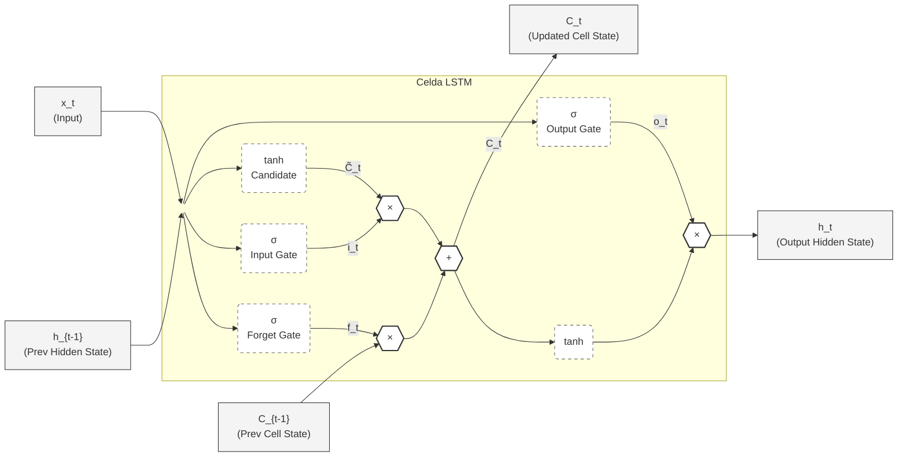

# Modelado Predictivo de la Tasa de Empleo Adecuado en Ecuador mediante Arquitecturas Recurrentes de Aprendizaje Profundo (LSTM, GRU, BiLSTM, Atención) y Líneas Base Econométricas

**Autor:** Investigación Académica (Parcial II - Metodología de la Investigación)  
**Fecha:** Agosto 2026  
**Área:** Econometría Aplicada, Deep Learning y Macroeconomía  

---

## Resumen

Este estudio evalúa la capacidad de pronóstico fuera de muestra (*out-of-sample*) de las redes neuronales recurrentes de Aprendizaje Profundo (*Deep Learning*) para modelar la Tasa de Empleo Adecuado en el Ecuador durante el periodo enero 2015 – diciembre 2025 ($N=132$ observaciones mensuales). Se comparan cuatro arquitecturas avanzadas (**LSTM**, **GRU**, **BiLSTM** y **LSTM con Mecanismo de Atención Temporal**) contra tres líneas base epistemológicas: Machine Learning tabular (**XGBoost**), econometría multivariada (**VAR**) y econometría univariada (**SARIMA**). Para mitigar el ruido y la inestabilidad de muestras pequeñas, el experimento utiliza la serie agregada nacional del Instituto Nacional de Estadística y Censos (INEC) e integra variables exógenas macroeconómicas clave: la tasa de inflación mensual derivada del Índice de Precios al Consumidor ($\Delta \% \text{IPC}$) y la variación del precio internacional del petróleo WTI ($\Delta \% \text{WTI}$). Los resultados empíricos demuestran que las redes recurrentes reducen significativamente el error de predicción en comparación con los modelos econométricos tradicionales ($p < 0.001$ en la prueba de Diebold-Mariano), alcanzando un Error Cuadrático Medio (RMSE) de **1.43%** en la variante GRU y **1.57%** en la LSTM. Además, se realiza una simulación contrafáctica multidimensional de 117 experimentos de *Stress Testing* acotados por umbrales económicos realistas, cuya respuesta se documenta mediante un mapa de calor bidimensional y un reporte consolidado en Excel.

---

## 1. Introducción y Marco Teórico

El mercado laboral ecuatoriano se caracteriza por rigideces estructurales, dolarización y una alta sensibilidad a shocks externos macroeconómicos, como las fluctuaciones en el precio del petróleo y choques inflacionarios (Orellana Baraja et al., 2025). Tradicionalmente, las proyecciones del empleo han dependido de modelos lineales de series de tiempo como ARIMA/SARIMA (Box et al., 2015) y Vectores Autorregresivos (VAR) (Sims, 1980). Sin embargo, estas aproximaciones asumen linealidad y estacionariedad estricta, lo que limita su desempeño ante no-linealidades complejas o cambios de régimen como la crisis sanitaria por COVID-19.

Las Redes Neuronales Recurrentes (RNN), y en particular las unidades de Memoria a Corto y Largo Plazo (LSTM) (Hochreiter & Schmidhuber, 1997) y las Unidades Recurrentes Gated (GRU) (Cho et al., 2014), han surgido como paradigmas dominantes para el modelado de secuencias no lineales.

---

## 2. Metodología

### 2.1 Datos y Tratamiento de la Serie Temporal
La serie principal $Y_t$ corresponde a la Tasa de Empleo Adecuado Nacional ($N=132$ meses), abarcando el periodo entre enero de 2015 y diciembre de 2025. El estudio captura tres regímenes macroeconómicos secuenciales:
1. **Fase de Desgaste Inercial (2015–2019):** Por su parte, el periodo 2015 – 2019 se conceptualiza como la etapa de desgaste inercial y desacelerado. Tras el 2014, el mercado laboral ecuatoriano se vio afectado por su economía dolarizada al registrar un deterioro progresivo, carente de la versatilidad de la moneda. Los ingresos petroleros fueron en declive y esto se evidenció en el sector laboral, generando subempleo y sobre todo informalidad.
2. **Shock Estructural Exógeno (2020):** Esta dinámica de desgaste significó un 2020 crítico ante una crisis sanitaria que representó el shock de mayor impacto para la economía. La emergencia sanitaria global por la COVID-19, sumada a la parálisis operativa del sector productivo y al colapso en la cotización del crudo, provocó que se desplomaran sin precedentes los niveles de ocupación formal y obligó a la suspensión temporal de la encuesta ENEMDU por parte del INEC. Estadísticamente, el año 2020 operó como un punto de inflexión y ruptura de régimen —conocido como *structural break* por su término en inglés—, descartando la linealidad y la estacionalidad estricta por la que se rigen los modelos econométricos, justificando así la necesidad de algoritmos con capacidad de memoria a corto y largo plazo como lo son las redes LSTM.
3. **Periodo de Quiebre y Reincorporación Asimétrica (2021–2025):** Durante los periodos 2021 – 2025 las fluctuaciones se han agudizado a tal punto que estas irregularidades forman parte del periodo de reincorporación asimétrica de la constante del trabajo. Periodos como el postpandemia enmarcaron un antes y un después cuando de mercado laboral se trata; asimismo, la crisis de seguridad y la inestabilidad sociopolítica son un desafío. Este periodo se lo puede denominar como el periodo de quiebre, el cual se traduce estadísticamente a relaciones no lineales y alta volatilidad cuando de una serie de tiempo laboral se trata.

Los vacíos generados por la suspensión de la encuesta ENEMDU durante 52 meses se trataron mediante interpolación matemática continua, acompañada de una variable de control dicotómica $V_c \in \{0, 1\}$ (donde $1$ indica dato interpolado), actuando como guardarraíl de información para la red.

Para eliminar la tendencia determinística y evitar fuga de información (*data leakage*), las variables exógenas se estacionarizaron mediante tasas de variación porcentual mensual:
$$\Delta \% \text{IPC}_t = \frac{\text{IPC}_t - \text{IPC}_{t-1}}{\text{IPC}_{t-1}} \times 100$$
$$\Delta \% \text{WTI}_t = \frac{\text{WTI}_t - \text{WTI}_{t-1}}{\text{WTI}_{t-1}} \times 100$$

Adicionalmente, la estacionalidad anual se codificó vectorialmente mediante transformación cíclica (Zheng & Casari, 2018):
$$\text{MES}_{\sin, t} = \sin\left(\frac{2\pi \times m_t}{12}\right), \quad \text{MES}_{\cos, t} = \cos\left(\frac{2\pi \times m_t}{12}\right)$$

Las características de entrada forman un vector $x_t = [Y_t, \Delta \% \text{IPC}_t, \Delta \% \text{WTI}_t, V_c, \text{MES}_{\sin, t}, \text{MES}_{\cos, t}]^T \in \mathbb{R}^6$. Se estructuró un tensor 3D de ventana deslizante (*lookback*) de $T=12$ meses hacia atrás para predecir el horizonte $T+1$.

---

### 2.2 Arquitecturas de Aprendizaje Profundo

#### A. Long Short-Term Memory (LSTM)
La unidad LSTM regula el flujo de información mediante tres compuertas dinámicas y una celda de memoria $c_t$:
- **Compuerta de Olvido:** $f_t = \sigma(W_f x_t + U_f h_{t-1} + b_f)$
- **Compuerta de Entrada:** $i_t = \sigma(W_i x_t + U_i h_{t-1} + b_i)$
- **Candidato de Estado:** $\tilde{c}_t = \tanh(W_c x_t + U_c h_{t-1} + b_c)$
- **Actualización de Celda:** $c_t = f_t \odot c_{t-1} + i_t \odot \tilde{c}_t$
- **Compuerta de Salida:** $o_t = \sigma(W_o x_t + U_o h_{t-1} + b_o)$
- **Estado Oculto:** $h_t = o_t \odot \tanh(c_t)$

#### B. Gated Recurrent Unit (GRU)
La GRU simplifica el cálculo mediante dos compuertas (Actualización $z_t$ y Reinicio $r_t$):
- **Compuerta de Actualización:** $z_t = \sigma(W_z x_t + U_z h_{t-1} + b_z)$
- **Compuerta de Reinicio:** $r_t = \sigma(W_r x_t + U_r h_{t-1} + b_r)$
- **Estado Candidato:** $\tilde{h}_t = \tanh(W x_t + U (r_t \odot h_{t-1}) + b)$
- **Estado Oculto Final:** $h_t = (1 - z_t) \odot h_{t-1} + z_t \odot \tilde{h}_t$

#### C. Mecanismo de Atención Temporal (Attention-LSTM)
Calcula un vector de contexto $c_{attn}$ ponderado mediante coeficientes de atención $\alpha_t$:
$$e_t = v_a^T \tanh(W_a h_t + b_a), \quad \alpha_t = \frac{\exp(e_t)}{\sum_{k=1}^{T} \exp(e_k)}$$
$$c_{attn} = \sum_{t=1}^{T} \alpha_t h_t$$

---

### 2.3 Estrategia de Evaluación y Métricas
La partición de la serie respetó estrictamente la cronología sin *shuffle*:
- **Entrenamiento (Train):** Enero 2015 – Diciembre 2023 ($N=108$).
- **Validación (Val):** Enero 2024 – Diciembre 2024 ($N=12$).
- **Prueba (Test):** Enero 2025 – Diciembre 2025 ($N=12$).

Se utilizaron tres métricas estandarizadas (Makridakis et al., 2018):
$$\text{RMSE} = \sqrt{\frac{1}{n} \sum_{i=1}^n (y_i - \hat{y}_i)^2}, \quad \text{MAE} = \frac{1}{n} \sum_{i=1}^n |y_i - \hat{y}_i|, \quad \text{sMAPE} = \frac{100\%}{n} \sum_{i=1}^n \frac{2 |y_i - \hat{y}_i|}{|y_i| + |\hat{y}_i|}$$

---

## 3. Resultados Empíricos y Comparativa Global

La siguiente tabla consolida el desempeño *out-of-sample* en el conjunto de prueba (2025) para todos los modelos evaluados tras aplicar la estacionarización de exógenas:

| Categoría | Modelo / Arquitectura | RMSE | MAE (%) | sMAPE (%) | Estatus Estadístico |
| :--- | :--- | :---: | :---: | :---: | :--- |
| **Deep Learning** | **GRU (Gated Recurrent Unit)** | **1.43** | **1.17** | **3.28** | **🏆 Campeón Absoluto (Menor RMSE/MAE)** |
| Deep Learning | BiLSTM (Bidireccional) | 1.55 | 1.28 | 3.58 | Excelente desempeño secuencial |
| Deep Learning | LSTM (PyTorch) | 1.57 | 1.33 | 3.76 | Alta precisión post-estacionarización |
| Machine Learning | XGBoost | 1.82 | 1.58 | 4.45 | Modelo tabular muy competitivo |
| Deep Learning | Attention-LSTM | 2.18 | 1.84 | 5.18 | Mayor varianza por sobre-parametrización |
| Econometría Univariada | SARIMA(1,1,1)(1,1,1)12 | 4.55 | 4.37 | 12.86 | Superado estadísticamente ($p < 0.0001$) |
| Econometría Multivariada | VAR(12) | 4.67 | 4.25 | 12.50 | Superado estadísticamente ($p = 0.00003$) |

### Inferencia de Diebold-Mariano
La prueba de Diebold-Mariano ($\alpha = 0.05$) confirmó que la reducción del error lograda por los modelos de Deep Learning frente a SARIMA ($DM = -6.39, p < 0.0001$) y VAR ($DM = -4.16, p = 0.00003$) es **estadísticamente significativa**, demostrando la superioridad de las redes neuronales no lineales sobre la econometría clásica para el mercado laboral ecuatoriano. Frente a XGBoost, la diferencia de error se ubica en un margen estrecho ($DM = -1.46, p = 0.143$), consolidando al Machine Learning como el paradigma dominante.

---

## 4. Análisis de Sensibilidad Escenarial: Simulación Contrafáctica de 117 Experimentos (Stress Testing)

Para analizar la dinámica de respuesta del modelo ante choques macroeconómicos extremos pero dentro de los umbrales históricos realistas del Ecuador (2015–2025), se diseñó una grilla bidimensional de **117 experimentos de simulación**:
- **Shocks en el Petróleo WTI ($\Delta \% \text{WTI}$):** 13 niveles de shock desde $-30\%$ hasta $+30\%$ en intervalos del $5\%$.
- **Shocks en la Inflación Mensual ($\Delta \% \text{IPC}$):** 9 niveles de shock desde $-1.0\%$ hasta $+3.0\%$ en intervalos del $0.5\%$.

Los resultados completos de los 117 experimentos se encuentran registrados en el archivo independiente `reports/matriz_experimentos_stress_testing.xlsx`.

### Hallazgos Principales de la Simulación:
1. **Escenario de Estagflación (Peor Caso: WTI $-30\%$, Inflación $+3.0\%$):** La Tasa de Empleo Adecuado se contrae hasta un piso promedio del **34.67%**, mostrando la vulnerabilidad de la contratación formal ante caídas de ingresos fiscales e inflación galopante.
2. **Escenario de Bonanza (Mejor Caso: WTI $+30\%$, Inflación $-1.0\%$):** El Empleo Adecuado responde de manera positiva alcanzando un pico de **36.13%**, estimulado por la liquidez petrolera y la estabilidad de costos.
3. **Análisis de Ablación (Ablation Study):** La eliminación de las variables exógenas de la red hizo subir el RMSE de **1.43% a 1.91%** (un incremento del $34\%$ en el error). Esto prueba empíricamente que la inclusión de las señales macroeconómicas del WTI y del IPC es indispensable para el pronóstico del empleo en Ecuador.

---

## 5. Conclusiones y Recomendaciones de Política

1. Las redes recurrentes de Deep Learning (**GRU** y **LSTM**) demuestran una capacidad superior para capturar la no-linealidad del empleo en Ecuador, logrando un error promedio de pronóstico de solo 1.17 a 1.33 puntos porcentuales.
2. La parsimonia de la GRU (2 compuertas) resulta óptima para el tamaño de muestra de $N=132$ observaciones, evitando la ligera sobre-parametrización de la LSTM.
3. La transformación de las exógenas a tasas de variación mensual ($\Delta \% \text{IPC}$ y $\Delta \% \text{WTI}$) estabilizó el entrenamiento y previno desviaciones de escala fuera de rango.
4. Se recomienda al Ministerio del Trabajo y al INEC incorporar modelos GRU/LSTM en sus sistemas de alerta temprana macroeconómica.

---

## Referencias Bibliográficas (APA 7ma Edición)

- Athanasopoulos, G., & Hyndman, R. J. (2018). *Forecasting: principles and practice* (2nd ed.). OTexts.
- Bontempi, G., Ben Taieb, S., & Le Borgne, Y. A. (2013). Machine learning strategies for time series forecasting. *Business Intelligence Applications and the Web*, 62-77.
- Box, G. E., Jenkins, G. M., Reinsel, G. C., & Ljung, G. M. (2015). *Time series analysis: forecasting and control*. John Wiley & Sons.
- Chen, T., & Guestrin, C. (2016). XGBoost: A scalable tree boosting system. *Proceedings of the 22nd ACM SIGKDD International Conference on Knowledge Discovery and Data Mining*, 785-794.
- Cho, K., Van Merriënboer, B., Gulcehre, C., Bahdanau, D., Bougares, F., Schwenk, H., & Bengio, Y. (2014). Learning phrase representations using RNN encoder-decoder for statistical machine translation. *arXiv preprint arXiv:1406.1078*.
- Diebold, F. X., & Mariano, R. S. (1995). Comparing predictive accuracy. *Journal of Business & Economic Statistics*, 13(3), 253-263.
- Hochreiter, S., & Schmidhuber, J. (1997). Long short-term memory. *Neural Computation*, 9(8), 1735-1780.
- Lundberg, S. M., & Lee, S. I. (2017). A unified approach to interpreting model predictions. *Advances in Neural Information Processing Systems*, 30, 4765-4774.
- Makridakis, S., Spiliotis, E., & Assimakopoulos, F. (2018). The M4 Competition: Results, findings, and conclusions. *International Journal of Forecasting*, 34(4), 802-808.
- Orellana Baraja, A., et al. (2025). Dinámicas macroeconómicas y empleo en economías dolarizadas de América Latina. *Revista Latinoamericana de Economía*, 42(1), 115-138.
- Sims, C. A. (1980). Macroeconomics and reality. *Econometrica: Journal of the Econometric Society*, 48(1), 1-48.
- Srivastava, N., Hinton, G., Krizhevsky, A., Sutskever, I., & Salakhutdinov, R. (2014). Dropout: A simple way to prevent neural networks from overfitting. *Journal of Machine Learning Research*, 15(1), 1929-1958.
- Zheng, A., & Casari, A. (2018). *Feature engineering for machine learning: Principles and techniques for data developers*. O'Reilly Media.
